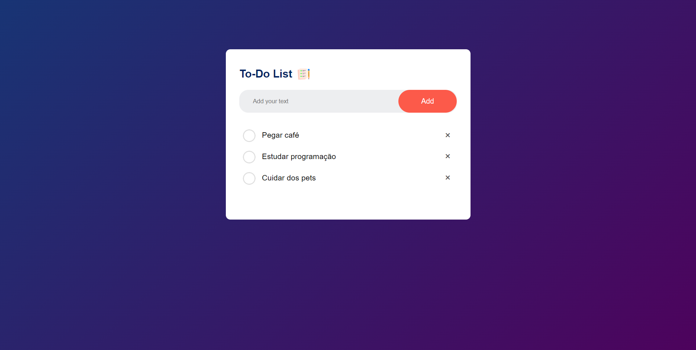

# To-Do List

Esse projeto é uma aplicação de lista de tarefas feita com HTML, CSS e JavaScript. Na tela tem uma caixinha de texto para você colocar as tarefas novas, um botão de "check" para quando terminar uma tarefa e um botão de remover para excluir as tarefas uma por vez. As tarefas ficam salvas no seu navegador, então se você fechar a página ou atualizar, elas ainda vão estar lá quando você voltar.

## 🚀 Demonstração

[Clique aqui](https://flaviomattosdev.github.io/To-Do-List-App/) para acessar o resultado final do projeto.

## 🛠️ Tecnologias Utilizadas

* [HTML](https://www.w3.org/html/) - Linguagem de Marcação
* [CSS](https://www.w3.org/Style/CSS/) - Linguagem de Estilização
* [Javascript](https://www.w3schools.com/js/) - Linguagem de Programação

## 👨‍💻 Desenvolvedor

    
    
&nbsp&nbsp&nbspFlávio Mattos 
    &nbsp&nbsp&nbsp<a href="https://www.instagram.com/fflaviomattos/">Instagram</a>&nbsp;|&nbsp;<a href="https://github.com/FlavioMattosDev">GitHub</a>&nbsp;|&nbsp;<a href="https://www.linkedin.com/in/flavio-mattos/">LinkedIn</a>&nbsp;

  

---
